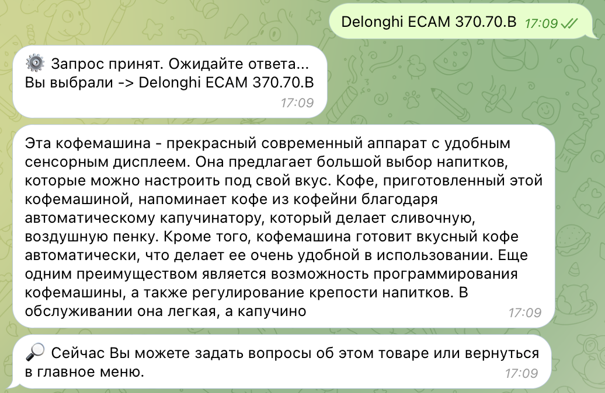

<br/>
<p align="center">
  <a href="https://github.com/KevinDev64/shop-agent">
    
  </a>

  <h3 align="center">AI consultant for the Store</h3>

  <p align="center">
    Modern shopping with personal Artificial Intelligence
    <br/>
    <br/>
    <a href="https://github.com/KevinDev64/shop-agent/issues">Report Bug</a>
    .
    <a href="https://github.com/KevinDev64/shop-agent/issues">Request Feature</a>
  </p>
</p>

    
 


## Table Of Contents

* [About the Project](#about-the-project)
* [Getting Started](#getting-started)
  * [Prerequisites](#prerequisites)
  * [Installation](#installation)
* [Roadmap](#roadmap)
* [Contributing](#contributing)
* [License](#license)
* [Authors](#authors)

## About The Project



This project is a wonderful prototype of a home appliance selection consultant using an artificial intelligence agent.
And that's why:
* :sparkling_heart: User-friendly interface of the wonderful Telegram messenger
* :blush: Intuitive, well-thought-out bot interface
* :money_with_wings: Easy launch and setup in your own store
* :sparkles: The agent adapts to any incoming data, even user reviews, even characteristics
* :sunglasses: The agent constantly educates himself and strives for the highest ideal 

Many new features will be added over time. The project is waiting for your suggestions for new features or changes :smile:


## Getting Started

This section describes basic settings and installation of required packages. Before doing this, you need to install the Anaconda Python distribution!

### Prerequisites

Here's how to set up a virtual environment

* Create a virtual environment and activate it

```sh
conda create --name shop-agent python=3.9
conda activate shop-agent
```

### Installation

1. Get a OpenAI API Key at [https://openai.com](https://openai.com)

2. Get a Telegram Bot API Key at [https://t.me/BotFather](https://t.me/BotFather)

3. Clone the repo

```sh
git clone https://github.com/kevindev64/shop-agent.git
```

4. Install requirements

```sh
pip3 install -r requirements.txt
```

5. Enter your OpenAI API Key in `utils/openai_token.txt`

6. Enter your Telegram Bot API Key in `utils/bot_token.txt`

## Roadmap

See the [open issues](https://github.com/KevinDev64/shop-agent/issues) for a list of proposed features (and known issues).

## Contributing

Contributions are what make the open source community such an amazing place to be learn, inspire, and create. Any contributions you make are **greatly appreciated**.
* If you have suggestions for adding or removing, feel free to [open an issue](https://github.com/KevinDev64/shop-agent/issues/new) to discuss it, or directly create a pull request after edit.
* Please make sure you check your spelling and grammar.
* Create individual PR for each suggestion.

### Creating A Pull Request

1. Fork the Project
2. Create your Feature Branch (`git checkout -b feature/AmazingFeature`)
3. Commit your Changes (`git commit -m 'Add some AmazingFeature'`)
4. Push to the Branch (`git push origin feature/AmazingFeature`)
5. Open a Pull Request

## License

Distributed under the GPL-3.0 License. See [LICENSE](https://github.com/KevinDev64/shop-agent/blob/main/LICENSE.md) for more information.

## Authors

* [KevinDev64](https://github.com/KevinDev64/) - *Main Developer*